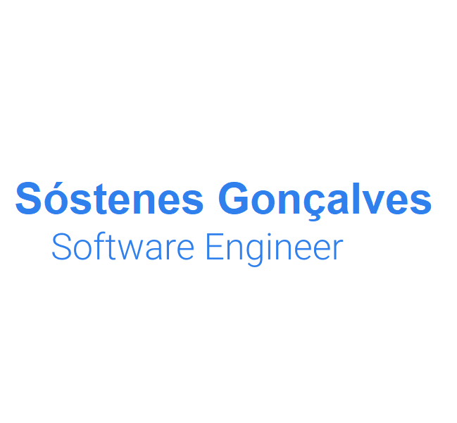

  
  

  
  

## Hi there! </h2>

### Abstract

- 👨‍💻 I'm currently working full-time at **<a href="https://www.squadra.com.br/">Squadra Tecnologia</a>**.
- 🌱 Learning more about and studying: **C#, .NET CORE, Machine Learning, Python, DevOps**.
- 💙 Interests: :heavy_dollar_sign: finance, investments, :computer: machine learning, artificial intelligence

### Languages and Tools

 

  
  
  
     
  
  
  
  
  
   
  

### Find me around the web 🌎:

- 💼 Connecting and sharing professional updates on <a href="https://www.linkedin.com/in/sostenesgsouza/">LinkedIn</a>.
